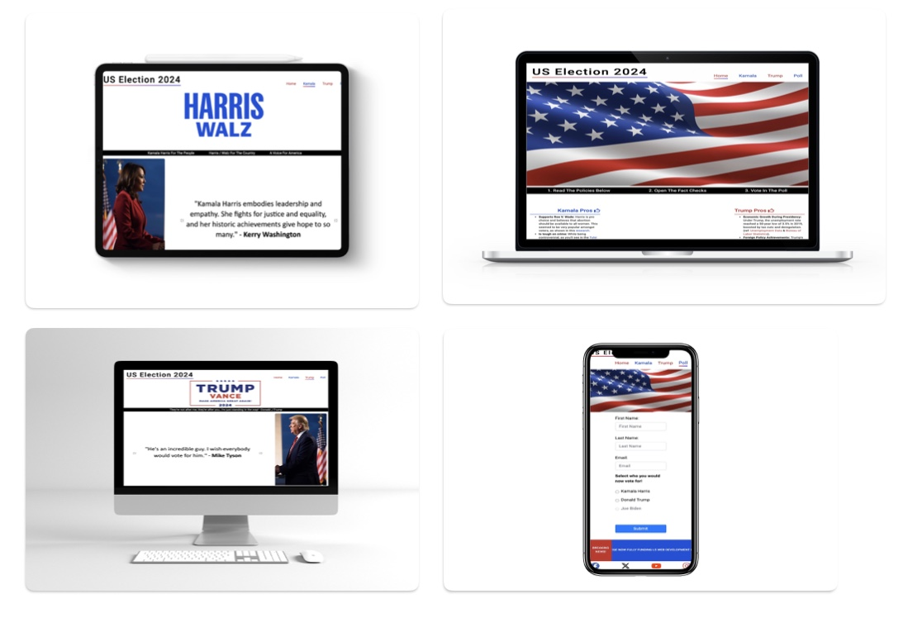
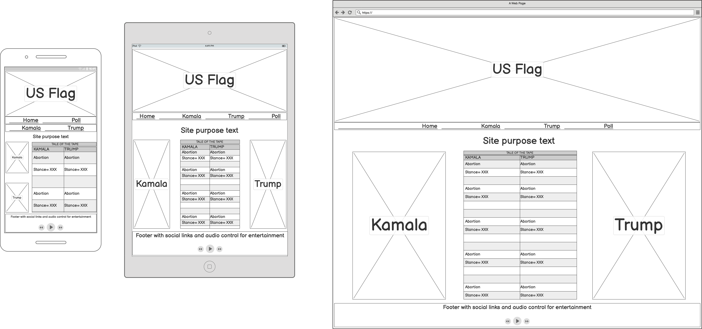
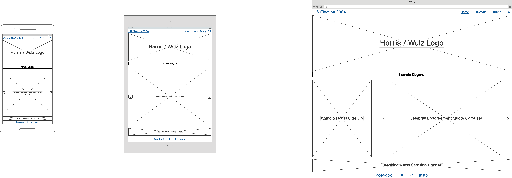
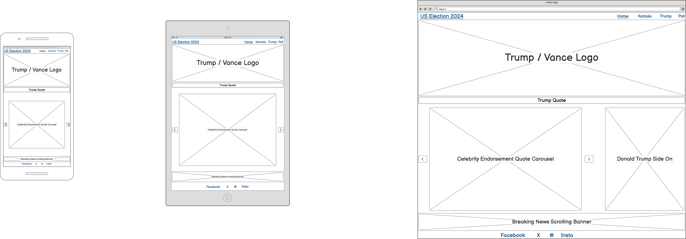
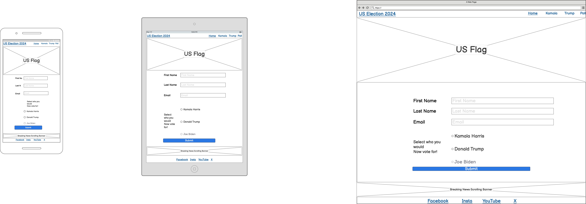

# Comparing Candidates for the 2024 U.S. Election

Visit the deployed site: [trumpvsharris2024](XXX)

Before you vote, explore detailed, fact-checked information about your candidate.

The US Election is one of the biggest elections in the world. 

[Wikipedia](https://en.wikipedia.org/wiki/Voter_turnout_in_United_States_presidential_elections) shows over 158 Million people turning out to vote in the 2020 election. With the 2024 election potentially bringing an even larger turnout, it's one of the most impactful decisions you will make. The good news is we're here to help.

## CONTENTS

* [User Experience](#user-experience-ux)
   * [User Stories](#user-stories)
   * [First Time Visitor Goals](#first-time-visitor-goals)
   * [Returning Visitor Goals](#returning-visitor-goals)
   * [Frequent Visitor Goals](#frequent-visitor-goals)

* [Design](#design)
  * [Colour Scheme](#colour-scheme)
  * [Typography](#typography)
  * [Imagery](#imagery)
  * [Wireframes](#wireframes)
  * [Features](#features)
    * [The Home Page](#the-home-page)
    * [The Donald Trump Page](#the-donald-trump-page)
    * [The Kamala Harris Page](#the-kamala-harris-page)
    * [The Poll Page](#the-poll-page)
    * [Future Implementations](#future-implementations)
  * [Accessibility](#accessibility)

* [Technologies Used](#technologies-used)
  * [Languages Used](#languages-used)
  * [Frameworks, Libraries & Programs Used](#frameworks-libraries--programs-used)

* [Deployment & Local Development](#deployment--local-development)
  * [Deployment](#deployment)
  * [Local Development](#local-development)
    * [How to Fork](#how-to-fork)
    * [How to Clone](#how-to-clone)

* [Testing](#testing)
  * [Solved Bugs](#solved-bugs)
  * [Known Bugs](#known-bugs)
  
* [Credits](#credits)
  * [Code Used](#code-used)
  * [Content](#content)
  * [Media](#media)
  * [Acknowledgments](#acknowledgments)

## User Experience (UX)

### User Stories

#### First Time Visitor Goals

   *  I want to know more about the candidates that are running in the US election 2024. I want it to be easy to understand. I want it to be fact checked. I want to be able to compare both side by side.
   *  I want the site to be responsive, so that I am able to look at it when at home by my desktop computer or out and about on my mobile phone.
   *  I want the site to be easy to navigate and to let me know what page of the site am I on.
   *  I want the site to be accessible, including alt texts and high-contrast colors.

#### Returning Visitor Goals

   *  I want to be able to choose a specific candidate for a more in depth deep dive on research.

#### Frequent Visitor Goals

   *  I want to be able to be able to log who I'm voting for and in future I'd like to see how others have voted.
   *  I want to be able to quickly pull up fact checks for either candidate for when I am talking in public about either choice.

  ---

## Design

## Colour Scheme

As the hero image on the page is of the United States flag which is red white and blue, and both the republic and democratic parties are red and blue. I thought it would be best to keep a consistent colour scheme throughout each page in the interest of UX.

In my css file, you will see I have used the below colours:

   * #000 - was used for the text in the overall design, minus some of the headings like the pros and cons.
   * #c6192d - Was used for anything connected to Donald Trump. As he is a Republican, I thought it would be good UX to give him the Republican red. 
   * #154fd7 - Was used for anything connected to Kamala Harris. As she is a Democrat, I thought it would be good UX to give her the Democratic blue.
   * linear-gradient to right red to blue (for gradient underline headings) - This was used for undeline headings on the logo and nav bar. It covers both parties going from a red to a blue.
   * #4267B2 for Facebook icon
   * #000 for X icon
   * #154fd7 for internet explorer icon
   * linear-gradient(45deg, #f09433, #e6683c, #dc2743, #cc2366, #bc1888) for instagram icon
   * #dc2743 for YouTube icon

### Typography

Google Fonts was used to import the chosen fonts for use in the site.

* For the page title and the body of the site, I have used the font [Roboto](https://fonts.googleapis.com/css2?family=Roboto:ital,wght@0,100;0,300;0,400;0,500;0,700;0,900;1,100;1,300;1,400;1,500;1,700;1,900&display=swap)

### Imagery

As the website is called US Election 2024, I wanted to go for a patriotic hero image for the Home page, which is why I've gone for the classic american flag.

I also wanted to keep the reasoning for the site obvious, in the interest of UX, which is why on the Home page, I have also used a Trump vs. Kamala side-by-side image. Then split this image up for consistency on their individual pages.

### Wireframes

Wireframes were created for mobile, tablet & also desktop computers, using the Balsamiq app.

### Features

The website is comprised of a home page giving a key breakdown of policies for both candidates, including links to fact checks or articles. A page exploring the celebrity endorsements each candidate has received, you can skip through each of the quotes using the carousel forwards and backwards buttons. Lastly a poll page where people can vote for who is the best candidate after reading the site.

All pages are responsive for mobiles, tablets & desktop computers with max widths of 600px 1080px and anything above 1080px respectively.

* The nav bar at the top of the page, so as to show what page the user is on & also ways to get back to different pages.

* All links and buttons will also have the pseudo element Hover applied to them.

#### The Home Page

The home page of Trump Vs Kamala 2024 displays a logo saying "US Election 2024" with a navigation bar directly beside it. Below this is a hero banner image of an American flag. Then there is a site purpose instruction below the hero image. The main body of the Home page is a centered image of Trump and Harris facing off in front of the Washington Monument. Either side of the image displays pros and cons with links and fact checks. I have put Kamala Harris on the left and Donald Trump on the right, mirroring the political side they stand on.

As I want to keep the site informative but minimalistic in the interest of UX, the last part of the home page will be the footer. On the footer it will have a breaking news scrolling banner and links to social media.

#### The Donald Trump Page

The Donald Trump page will have the same logo and nav bar that is displayed across the top of every page for consistency. Below this will be the TRUMP / VANCE image logo. The background color will be white, and the font will be blue for Trump and red for Vance. It will also contain the slogan ‘Make America Great Again’ with a solid red border and ‘2024’ in blue at the bottom. This is for consistency to what the user would see everywhere else.

Below the banner, in replace of the site purpose instructions, it will show a motivational quote spoken by Donald Trump.

Below the slogan/quote will have a picture of Donald Trump on the right and then a carousel on the left with forward and backward buttons. The carousel will show 5 celebrity endorsements given to Donald Trump by various public figures.

For consistency, at the bottom of the page will be the same footer as is also across every other page. The only differences are social links to follow Donald Trump and a link to donate to Donald Trumps campaign and also different messages on the breaking news banner.

#### The Kamala Harris Page

The structure of this page will follow the Donald Trump page with a logo and nav bar at the top. Then below will be the Harris / Walz image logo. The background color will be white, with Harris and Walz text in blue.

Below the banner will be the motivational quotes/slogans for Kamala Harris

Below the quotes/slogans will be a picture of Kamala Harris on the left and the same carousel feature with celebrity endorsements for Harris.

lastly at the bottom of the page will include social links to Kamala Harris and a link to donate to Kamala Harris campaign and the breaking news banner, tailored towards Kamala Harris.

#### The Poll Page

The top of the page for UX and consistency will have the logo and the nav bar showing what page the user is on.

Below this will be a banner with the image of the american flag, the same hero image that is on the home page.

Below the nav bar will be a form with inputs for First Name, Last Name, Email, and a question asking the user who they would vote for.

Alongside the question, there will be a container with 3 radio buttons: one for Kamala Harris, one for Donald Trump, and for comedic value, a disabled radio button for Joe Biden, who dropped out of the race.

Lastly will be a blue submit button with the pseudo hover class.

Lastly the bottom of the page will be the footer. Again this will include the breaking news banner and links to my social media.

#### Future Implementations

In future I would like to:

1. Allow users to see live results on the poll page as soon as they select a candidate.
2. Create a backend AI script to update the top 5 criticisms of each candidate after any event such as public debates or rallies etc... this could be pulled from viral moments across any social media.
3. Also screen reader compatibility using hover effects.
 

### Accessibility 

I have ensured to keep accessibility at the forefront when writing my code. I wanted to do this so that the site is accessible friendly. The below are some of the things I've implemented:

* Using Roboto font across the site with a backup of sans-serif, which is known to be dyslexia-friendly due to clear letter shapes, generous spacing and uniformity.
* Using alt text on any images.
* Using aria-label on any links.
* The site mainly uses red and blue as its primary colors, which is a palette known to be color-blind-friendly.

---

### Technologies Used

### Languages Used

HTML5 & CSS3.

### Frameworks, Libraries & Programs Used

* [Balsamiq](https://balsamiq.com/) - Used to create wireframes.

* [Git](https://git-scm.com/) - For version control.

* [GitHub](https://github.com/) - To save and store the files for the website.

* [GitPod](https://gitpod.io/) - IDE used to create the site.

* [Google Fonts](https://fonts.google.com/) - To import the fonts used on the website.

* [Google Developer Tools](https://developers.google.com/web/tools) - To troubleshoot and test features, solve issues with responsiveness and styling. Lastly to test lighthouse scores.
* [Bootstrap](https://getbootstrap.com/docs/4.6/getting-started/introduction/) - For some of the contents used across the site.

* [Flexbox](https://css-tricks.com/snippets/css/a-guide-to-flexbox/) - For some of the layout and styling elements of the website.

* [Shields.io](https://shields.io/) To add badges to the README.

* [Adobe Stock](https://stock.adobe.com/uk/) To generate the American flag with the suitable license to have it on my site.

* [Midjourney AI](https://www.midjourney.com/home) To create the Kamala / Trump faceoff picture.

* [Google images](https://www.google.com/) To create the Kamala / Trump image logos that are license free.

---

## Deployment & Local Development

### Deployment

The site is deployed using GitHub Pages - [XXX](XXX)

To Deploy the site using GitHub Pages, follow the below actions:

1. Sign Up or Login to GitHub.
2. Go to the repository for the project, for this project it would be [Trump Vs Harris](https://github.com/RWilliamsCoding/trumpvsharris).
3. Click the settings buttons at the top of the page on the nav bar.
4. In the left hand nav menu, select Pages.
5. Under the source heading, select Deploy from a branch.
6. The site has now been deployed. 

### Local Development

#### How to Fork

To fork the repository, follow the below actions:

1. Sign Up or Login to GitHub.
2. Go to the repository for the project, for this one it would be [Trump Vs Harris](https://github.com/RWilliamsCoding/trumpvsharris).
3. Near the top of the page on the right hand side you'll see an option saying Fork, select this option.
4. Click Create Fork.

#### How to Clone

To clone the repository, follow the below actions:

1. Sign Up or Login to GitHub.
2. Go to the repository for the project, for this one it would be [Trump Vs Harris](https://github.com/RWilliamsCoding/trumpvsharris).
3. Click on the code button, select whether you would like to clone with HTTPS, SSH or GitHub CLI and copy the link shown.
4. Open the terminal in your code editor and change the current working directory to the location you want to use for the cloned directory.
5. Type "git clone" into the terminal and then paste the link you copied in step 3 and then press enter.

---

## Testing

Please refer to [Lighthouse](/testing/lighthouse/) & [W3](/testing/W3/) file for all the testing I have carried out. In the interest of keeping this README aesthetically pleasing, I decided it would be cleaner to put all the testing in a separate folder.

### User Story-Based Manual Testing
| Page | User Story | Expected | Tested | Result | Fix |
| :--- | :--- | :--- | :--- | :--- | :--- |
| Poll | As a frequent visitor, I want to submit my vote in the poll. | Form submits successfully when all fields are filled in and a candidate is selected. | Entered "John", "Doe", "john@example.com", selected "Donald Trump", clicked submit. | Form redirected to FormDump confirmation page. | N/A |
| Poll | As a frequent visitor, I want to be alerted when my email is invalid | Form should prevent submission and prompt the user to fix the email address. | Entered "John", "Doe", "John@", selected "Kamala Harris", clicked submit. | HTML5 validation blocked submission. | N/A |
| Index | As a first time visitor, I want to compare the pros and cons of candidates.| Each section shows candidate name, pros, cons, and fact-checked links. | Scrolled through the index page, verified content visibility and link clickability. | All sections appeared as intended with working links. | N/A |
| Index | I want to clearly see what page I’m on using the nav bar. | Current page nav item should have a different style (e.g., "nav-active" class). | Visited all pages and checked nav bar styles. | Current page link was highlighted correctly. | N/A |
| Trump | As a returning visitor, I want to explore Trump’s endorsements. | Carousel should show quotes and be navigable with next/prev buttons. | Used carousel buttons and indicators to view all slides. | Carousel functioned correctly and all images loaded. | N/A |
| All | I want the site to be accessible and responsive. | Alt text should exist on all images, ARIA labels on links, and site should look good on all devices. | Checked images and links, resized browser window. | Site adjusted responsively with correct alt/ARIA labels. | N/A |
| All | I want external links to open in a new tab. | All external links should have `target="_blank"`. | Clicked external links in footer and body. | All links opened in new tabs. | N/A |

### Solved Bugs

| No. | Bug | How I removed the bug
| :--- | :--- | :--- |
| 1 | Hero image wouldnt change width. | removed margin and padding then re-applied css rules to resolve.
| 2 | Can't get nav links to change color and remove underline. | Was targeting the nav as an ID using the class name. When changing the target from an ID to a class, it worked.
| 3 | Bullet points not showing up on page. | Realised that * CSS rule was applying margin and padding to the whole page. Knowing that unordered and ordered     lists require margin I removed this ruling.
| 4 | CSS styling rules weren't showing. | had to try and change different elements to trial and error of where I was going wrong, targeted footer i elements rather than div class.
| 5 | Whole about section needed styling as layout was wrong | after being stuck for weeks i decided to wrap the headings (pros and cons), the bullet points and the faceoff image in completely separate div elements. i then wrapped the whole section in a container and gave that a flex display and styled the individual divs seperately from there.
| 6 | Cant get the "BREAKING NEWS!" text to not scroll and just sit in the red div, along with having the "News Text" to scroll behind the red box. | fixed the scrolling behind by applying absolute positioning and setting z-index's to both properties prioritising the BREAKING NEWS!. fixed the static text by wrapping the elements in individual divs. previously i was targeting .scrolling-banner p and then also trying to target scrolling-banner-left p which was nested inside the scrolling-baner div. 
| 7 | Cant get carousel buttons and indicators to show up as background color white and indicators are white. when changing background color and size it offsets the buttons and indicators | Changed aria-hidden from true to false under prev and next icons and set margin for the carousel. also set color as rgba (0,0,0,0.5) to give a slight background color to the indicators and all of these changes then fixed the problems.
| 8 | Couldn't get the Kamala slogans 2 & 3 to hide when viewing on a smaller device | had to use the important tag in CSS to override the bootstrap generic styling.
| 9 | Couldn't get the margin to move the carousel on Kamala's page | again, bootstrap generic rulings were stopping this. When I added the important value in CSS this resolved the bug.

### Known Bugs

* I can’t seem to align the placeholder width in the form section of the poll page with the submit button.

* There is a CSS error on the console saying that the background clip needs to be defined for compatibility, but it is already defined for the Instagram icon which is working with no issues.

[Console Warning for CSS](/testing/known-bugs/cssbug.jpeg)

---

## Credits

### Code Used

* Videos I watched on YouTube:

   * Learn CSS [Flexbox](https://www.youtube.com/watch?v=wsTv9y931o8&list=WL&index=24&t=39s) in 20 Minutes.

   * Everything you need to know about CSS [Gradients](https://www.youtube.com/watch?v=e6jnl3iAezM&t=478s).

   * CSS ::Before and ::After [pseudo](https://www.youtube.com/watch?v=dIUOWdwwZBw)

* Code Institute lessons

* Stack Overflow for [Instagram](https://stackoverflow.com/questions/37751375/instagram-new-logo-css-background) colours.

### Content

I pulled the pros and cons, along with the references to the facts for both candidates from the Chat GPT API.

I researched the fact checks and got this information from the following:

   1. Roe Vs Wade documents.
   2. Tulsi Gabbard debate with Kamala Harris in 2016.
   3. BBC News.
   4. Fox News. 
   5. CNN.
   6. Bureau of Labor Statistics.
   7. The Abrahama Accords.
   8. Politifact.

All other content and styling was completed by myself.

### Media

[US Flag](https://stock.adobe.com/uk/search?k=american+flag&search_type=recentsearch&asset_id=83607290)
[Trump Logo](https://commons.wikimedia.org/wiki/File:TrumpVance2024.png)
[Harris Logo](https://commons.wikimedia.org/wiki/File:Harris_Walz_2024_presidential_campaign_logo_%28light_blue%29.svg)

### Acknowledgments

I would like to thank the following:

* Jubril Akolade - My Code Institute mentor.

* My Slack community - jul-2024-pla group.

* Marko Tot - Slack @Marko_ci.

* Vernell Clark - Slack user @vernell_5p_lead.

* Code Institute team.