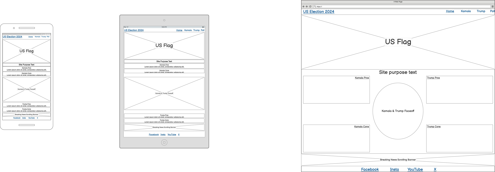

# Comparing Candidates for the 2024 U.S. Election.

Visit the deployed site: [trumpvsharris2024](XXX)

Before you vote, explore detailed, fact-checked information about your candidate.

The US Election is one of the biggest elections in the world. 

[Wikipedia](https://en.wikipedia.org/wiki/Voter_turnout_in_United_States_presidential_elections) shows over 158 Million people turning out to vote in the 2020 election. With the 2024 election possibly going to bring an even bigger turnout, it's one of the most impactful decisions you will make. The good news is we're here to help.

## CONTENTS

* [User Experience](#user-experience-ux)
* [User Stories](#user-stories)

## User Experience (UX)

### User Stories

#### First Time Visitor Goals

   *  I want to know more about the candidates that are running in the US election 2024. I want it to be easy to understand. I want it to be fact checked. I want to be able to compare both side by side.
   *  I want the site to be responsive, so that I am able to look at it when at home by my desktop computer or out and about on my mobile phone.
   *  I want the site to be easy to navigate and to let me know what page of the site am I on.
   * I also want the site to be accessible friendly such as alt texts and contrast of colours.

#### Returning Visitor Goals

   *  I want to be able to choose a specific candidate for a more in depth deep dive on research.

#### Frequent Visitor Goals

   *  I want to be able to be able to log who I'm voting for and in future I'd like to see how others have voted.
   *  I want to be able to quickly pull up fact checks for either candidate for when I am talking in public about either choice.

  - - -

## Design

## Colour Scheme

As the hero image on the page is of the United States flag which is red white and blue, and both the republic and democratic parties are red and blue. I thought it would be best to keep a consistent colour scheme throughout each page in the interest of UX.

In my css file, you will see I have used the below colours:

   * #f5f5f5 & #000000  
   * red
   * blue

### Typography

Google Fonts was used to import the chosen fonts for use in the site.

* For the page title the site features the font [XXX](XXX)

*For the body of the page the site uses the google font [XXX](XXX)

### Imagery

As the website is called US Election 2024, I wanted to go for a patriotic hero image for the Home page, which is why I've gone for the classic american flag.

I also wanted to keep the reasoning for the site obvious, in the interest of UX, which is why on the home page I have also used a Trump Vs. Kamala side by side.

### Wireframes

Wireframes were created for mobile, tablet & also desktop computers, using the Balsamiq app.

### Features

The website is comprised of a home page giving a simplistic key breakdown of policies for both candidates. A page deep diving into Donald Trump with 5 of his most criticised stance on policies, what he has said about them specifically, the fact check for them and the reference link to that fact check. Next is a page deep diving into Kamala Harris, looking at the exact same things as the Donald Trump page & lastly a poll page where people can vote for who is the best candidate after reading the site.

All pages are responsive from XXpx to XXpx and have:

* A favicon in the browser tab
   
  

* The nav bar at the top of the page, so as to show what page the user is on & also ways to get back to different pages.

* All links and buttons will also have the pseudo element Hover applied to them.

#### The Home Page

The home page of Trump Vs Kamala 2024 displays a hero banner image of an American flag at the top of the page. A navigation bar directly below it. Then there is a picture of Kamala Harris on the left and Donald Trump on the right. With a comparison table in the middle of them highlighting the main key point where each stand. In combat sports this is known as Tale Of The Tape.

As I want to keep the site informative but minimalistic in the interest of UX, the last part of the home page will be the footer. On the footer it will have links to social media & an audio controller to play some entertaining songs such as the theme music to Rocky.

#### The Donald Trump Page

The Donald Trump page will feather the same height and width banner but with the TRUMP / VANCE logo. The background color will be white and the font will be Blue for Trump and Red for Vance, it will also contain the slogan Make America Great Again, with a solid blue border and a break at the bottom which will include the text 2024 in red. This is for consistency to what the user would see everywhere else.

Below the banner will be the same nav bar as the home page for cosistency & UX. This will show what page the user is on by a bottom border.

Below the nav bar will have a picture of Donald Trump on the left and then text on the right detailing the top 5 criticisms of him. These will also include a fact check and the reference to that fact check.

For consistency, at the bottom of the page will be the footer. This will include social links to follow Donald Trump and a link to donate to Donald Trumps campaign. 

#### The Kamala Harris Page

The structure of this page will follow the Donald Trump page with a banner at the top with the Harris / Walz logo. Background color will be white, Harris text will be Blue, Walz text will be red and will have a solid blue border around it.

Below the banner will be the nav bar for UX. Showing what page the user is on.

Below the banner will be a picture of Kamala Harris on the left and her top 5 most criticisms and again, will include, fact checks and reference for those fact checks.

lastly at the bottom of the page will include social links to Kamala Harris and a link to donate to Kamala Harris campaign.

#### The Poll Page

The top of the page for UX and consistency will have a banner with the image of the american flag with the text inside saying Have Your Say.

Below the banner will be the nav bar for UX. Showing what page the user is on.

Below the nav bar will be text asking the user if now after they're done reading the fact checks, who would they vote for?

Below the text will have a container with 2 radio buttons. One for Donald Trump and below it One for Kamala Harris.

Below the container will be another container showing the results of the poll.

Lastly the bottom of the page will be the footer. this will include links to my social media, Donald Trumps social media and Kamala Harris social media.

#### Future Implementations

In future I would like to:

1. Allow users to see live results on the poll page as soon as they select a candidate.
2. Create a backend AI script to update the top 5 criticisms of each candidate after any event such as public debates or rallies etc... this could be pulled from viral moments across any social media.
3. Lastly I would like to increase accessibility with speech to text and also screen reader using the pseudo element Hover.
 

### Accessibility 

I have ensured to keep accessibility at the forefront when writing my code. I wanted to do this so that the site is accessible friendly. The below are some of the things I've implemented:

* Using Sans-Serif font across the site, which is known to be dyslexia-friendly due to clear letter shapes, generous spacing and uniformity.
* Using alt text on any images.
* Using semantic HTML.
* The site mainly uses Red & Blue as it's primary colors which is a palette known to be color-blind-friendly.

---

### Technologies Used

### Languages Used

HTML5 & CSS3.

### Frameworks, Libraries & Programs Used

* [Balsamiq](https://balsamiq.com/) - Used to create wireframes.

* [Git](https://git-scm.com/) - For version control.

* [GitHub](https://github.com/) - To save and store the files for the website.

* [GitPod](https://gitpod.io/) - IDE used to create the site.

* [Google Fonts](https://fonts.google.com/) - To import the fonts used on the website.

* [Google Developer Tools](https://developers.google.com/web/tools) - To troubleshoot and test features, solve issues with responsiveness and styling.

---

## Deployment & Local Development

### Deployment

The site is deployed using GitHub Pages - [XXX](XXX)

To Deploy the site using GitHub Pages, follow the below actions:

1. Sign Up or Login to GitHub.
2. Go to the repository for the project, for this project it would be [XXX](XXX).
3. Click the settings buttons at the top of the page on the nav bar.
4. In the left hand nav menu, select Pages.
5. Under the source heading, select Deploy from a branch.
6. The site has now been deployed. 

### Local Development

#### How to Fork

To fork the repository, follow the below actions:

1. Sign Up or Login to GitHub.
2. Go to the repository for the project, for this one it would be [XXX](XXX).
3. Near the top of the page on the right hand side you'll see an option saying Fork, select this option.
4. Click Create Fork.

#### How to Clone

To clone the repository, follow the below actions:

1. Sign Up or Login to GitHub.
2. Go to the repository for the project, for this one it would be [XXX](XXX).
3. Click on the code button, select whether you would like to clone with HTTPS, SSH or GitHub CLI and copy the link shown.
4. Open the terminal in your code editor and change the current working directory to the location you want to use for the cloned directory.
5. Type "git clone" into the terminal and then paste the link you copied in step 3 and then press enter.

---

## Testing

Please refer to [XXX](XXX) file for all the testing I have carried out. In the interest of keeping this README aesthetically pleasing, I decided it would be cleaner to put all the testing in a separate folder.

### Solved Bugs

| No. | Bug | How I removed the bug
| :--- | :--- | :--- |
| 1 | Hero image wouldnt change width. | removed margin and padding then re-applied css rules to resolve.
| 2 | XXX.
| 3 | XXX.
| 4 | XXX.
| 5 | XXX.

### Known Bugs

* XXX

[Example](XXX)

* XXX

[Example](XXX)

---

## Credits

### Code Used

* Videos I watched on YouTube:

* Code Institute lessons

### Content

I pulled the top 5 criticisms for both candidates from the Chat GPT API.

I researched the fact checks and got this information from the following:

   1. XXX

All other content and styling was completed by myself.

### Media

[US Flag](XXX)
[Donald Trump](XXX)
[Kamala Harris](XXX)
[Trump Logo](XXX)
[Harris Logo](XXX)
[Audio](XXX)

### Acknowledgments

I would like to thank the following:

* Jubril Akolade - My Code Institute mentor.

* My Slack community - 

* Marko Tot - Slack